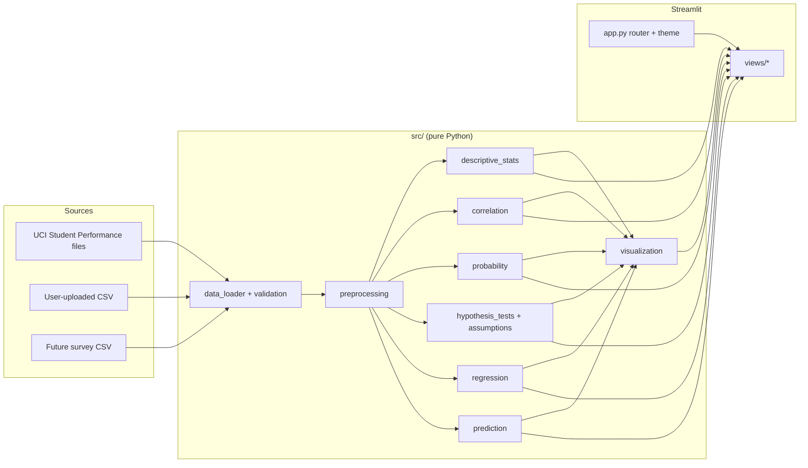
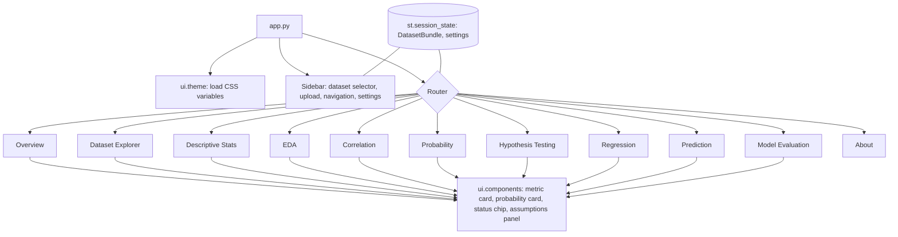
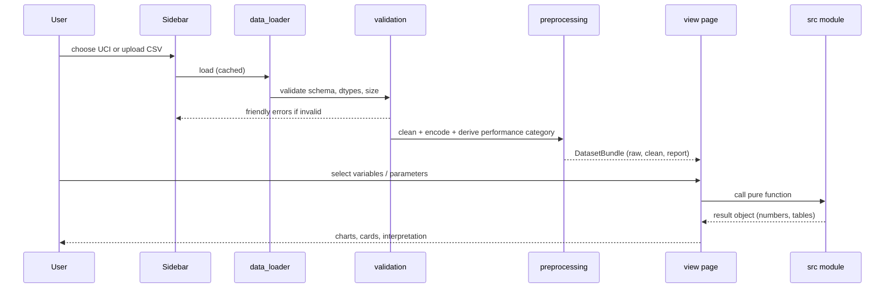
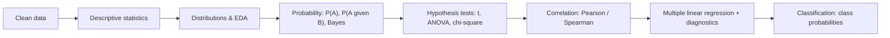
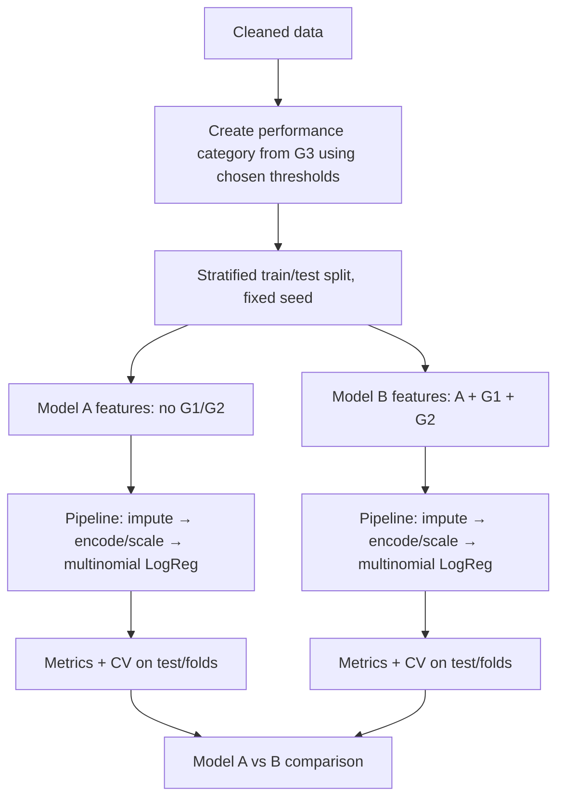
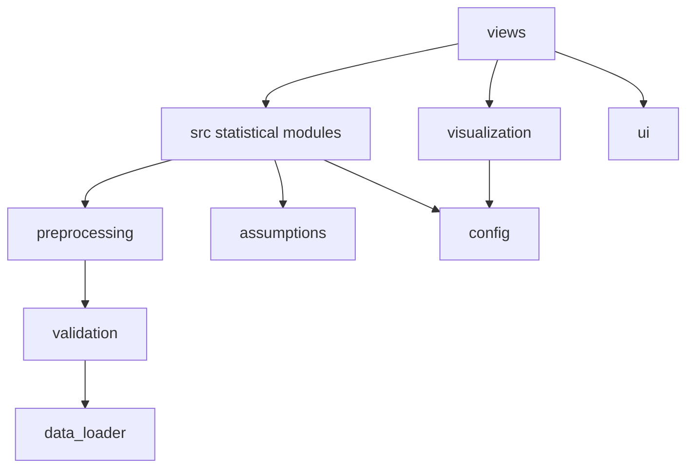

# EduLens: Architecture

## 1. Design Principles

1. **Statistics live in `src/`, never in page files.** Pages only collect inputs, call `src/` functions and render results. This makes every statistic unit-testable and traceable.
2. **Pure functions, typed results.** Statistical functions take a DataFrame and parameters and return a dataclass/dict (never print or call Streamlit).
3. **One source of truth for the data.** A single `DatasetBundle` (raw, cleaned, metadata, column roles) flows through the app via `st.session_state`.
4. **No leakage by construction.** Feature sets for Model A and Model B are defined in one place (`config.py`) and guarded by a test.
5. **Simple stack.** Streamlit + Python scientific stack. No backend services.

## 2. Changes to the suggested folder structure (and why)

| Change | Reason |
|---|---|
| `pages/` → **`views/`** | A folder named `pages/` makes Streamlit auto-generate its default sidebar navigation, which conflicts with the custom EduLens sidebar. We use `st.navigation` / a custom router in `app.py` with `views/`. |
| Added `src/config.py` | Central place for column roles, G1/G2 exclusion list, default thresholds, seed, α. |
| Added `src/ui/` (`theme.py`, `components.py`) | Injects CSS variables and reusable cards (metric card, probability card, status chip). Keeps CSS out of analysis code. |
| Added `src/validation.py` | CSV validation and user-friendly error types in one place. |
| Added `src/assumptions.py` | Shapiro, Levene, expected-count and VIF checks reused by tests and regression. |
| Added `assets/styles/edulens.css` | CSS lives in a file, loaded once. |
| Tests mirror `src/` | `tests/test_probability.py`, etc. |

## 3. Folder Structure

```
edulens/
├── app.py                      # entry: set_page_config, theme, sidebar, router
├── views/                      # Streamlit page scripts (UI only)
│   ├── _analysis.py            # cached fitting/evaluation helpers
│   ├── overview.py
│   ├── dataset_explorer.py
│   ├── descriptive_statistics.py
│   ├── exploratory_analysis.py
│   ├── correlation.py
│   ├── probability.py
│   ├── hypothesis_testing.py
│   ├── regression.py
│   ├── prediction.py
│   ├── model_evaluation.py
│   └── about.py
├── src/
│   ├── config.py
│   ├── data_loader.py
│   ├── validation.py
│   ├── preprocessing.py
│   ├── descriptive_stats.py
│   ├── correlation.py
│   ├── probability.py          # conditional, Bayes, distributions
│   ├── assumptions.py
│   ├── hypothesis_tests.py
│   ├── regression.py
│   ├── prediction.py           # pipelines, Model A / B, metrics
│   ├── visualization.py
│   └── ui/
│       ├── theme.py
│       └── components.py
├── data/
│   ├── raw/                    # downloaded UCI files (not committed if policy says so)
│   ├── processed/
│   └── README.md
├── models/                     # generated artifacts (git-ignored)
├── assets/
│   ├── logo/
│   ├── images/
│   └── styles/edulens.css
├── tests/
├── docs/
├── requirements.txt
├── README.md  PRD.md  ARCHITECTURE.md  DATASET.md
├── STATISTICAL_METHODS.md  DESIGN.md  REQUIREMENTS.md
├── CONTRIBUTING.md  .gitignore
```

## 4. System Architecture



## 5. Component Architecture (Streamlit)



**Shared settings (sidebar → session state):** dataset choice, confidence level (default 0.95), α (default 0.05), performance threshold method and values, random seed.

## 6. Data Flow



## 7. Statistical Pipeline



Each stage reads the cleaned data and the shared settings. No stage mutates the data.

## 8. Prediction Pipeline (leakage-safe)



Rules:
- The category is derived from **G3**; G3 is never a feature.
- Preprocessing is inside the `Pipeline`, so it is fit on training folds only.
- `config.LEAKY_COLUMNS = ["G1", "G2", "G3"]` is removed for Model A; a unit test asserts none appear in its feature names (after encoding too).
- Thresholds derived from quantiles are computed on the **training** set only, or documented as a fixed-band choice to avoid leakage.

## 9. Module Responsibilities

| Module | Responsibility |
|---|---|
| `config.py` | Constants: seed, α, column roles, leaky columns, default bands |
| `data_loader.py` | Load UCI files / uploaded CSV; cached; returns raw DataFrame + metadata |
| `validation.py` | Encoding/delimiter, empty data, required columns, dtype checks → friendly exceptions |
| `preprocessing.py` | Missing/duplicate/outlier reports, encoding, derived categories, before/after report |
| `descriptive_stats.py` | Summary table, mode, quartiles, IQR, skewness, group summaries |
| `correlation.py` | Pearson/Spearman matrices, ranked table, strength labels |
| `probability.py` | P(A), P(B), P(A∩B), P(A\|B), Bayes, binomial/normal/empirical fits |
| `assumptions.py` | Shapiro–Wilk, Levene, expected counts, VIF, residual tests |
| `hypothesis_tests.py` | t-test (Welch default), ANOVA + Tukey, chi-square, effect sizes, CIs |
| `regression.py` | statsmodels OLS, diagnostics data, coefficient tables |
| `prediction.py` | Pipelines, split, CV, metrics, Model A/B, probability output |
| `visualization.py` | Plotly/Matplotlib/Seaborn figure builders with shared theme |
| `ui/theme.py` | Inject CSS, define palette tokens |
| `ui/components.py` | HTML/markdown cards and chips (escape user text) |
| `views/*` | Layout and widgets only |

## 10. Dependency Flow

`views → src statistical modules, visualization, and shared UI components → config`. Statistical
analysis modules do not import Streamlit or views. The presentation-only modules
`src/ui/theme.py` and `src/ui/components.py` do import Streamlit as shared UI helpers; data and
model caching live in `app.py` and `views/_analysis.py`, not in the statistical modules.



## 11. Streamlit Architecture Notes

- **Routing:** `app.py` creates `st.Page` entries for scripts under `views/` and runs them through `st.navigation`; pages are scripts, not `render(bundle, settings)` modules.
- **Caching:** `st.cache_data` wraps UCI/upload loading in `app.py`; fitted OLS and prediction evaluations are cached through `st.cache_resource` helpers in `views/_analysis.py`, keyed by dataset and settings.
- **State:** `st.session_state` holds the active `DatasetBundle`, uploaded-file hash and settings; changing the dataset invalidates dependent caches.
- **CSS:** one stylesheet injected once via `st.markdown(unsafe_allow_html=True)`; variables on `:root`; Streamlit's internal class names are targeted sparingly, because they can change between versions.
- **Error handling:** expected loader and analysis exceptions are caught at the app/page boundary and shown as friendly `st.error`/`st.warning` messages; raw tracebacks are not rendered to users.
- **Security:** user-provided text (column names, categories) is HTML-escaped before inclusion in custom HTML.
- **Streamlit import boundary:** the statistical implementation stays Streamlit-free. The two
  `src/ui/` presentation helpers are the documented UI-bound exception required by the shared
  theme/component design; they contain no statistical calculations.

## 12. Testing Strategy

- Unit tests with tiny hand-calculable fixtures (probabilities, Bayes, chi-square).
- Cross-check against SciPy/statsmodels results.
- Leakage test for Model A feature names.
- Validation tests for malformed CSVs.
- Streamlit smoke tests use `streamlit.testing.v1.AppTest` for all 11 routes with the Portuguese course data and an invalid uploaded CSV.
